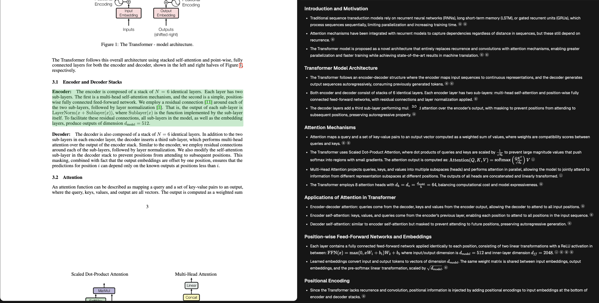

**Please read through the entire README doc.**

**You are free to use generative AI tools such as Cursor, Claude code, and others to assist you during this project.**

# Summary Generation Task

## Project Overview

The task is to implement a **streaming summary generator** with the following features:

1. **Backend Streaming**
   - Implement streaming response from the LLM using FastAPI
   - Stream the summary content in real-time to the frontend
  
2. **Frontend**
   - Use **react-query** to handle api calls as well as the streaming output.
   
4. **Source Citations**
   - The generated summary must include inline citations referencing specific parts of the source document
   - Citations should be embedded naturally within the summary text
   
5. **Interactive Citations**
   - When users click on a cited source in the summary:
     - Navigate to the exact page in the PDF viewer
     - Highlight the specific bounding box (bbox) region containing the cited content
   - Provide visual feedback for the highlighted regions

### Expected Deliverables

- A fully functional streaming summary generator
- Backend implementation that properly streams LLM responses
- Frontend that displays the PDF and streaming summary side-by-side
- Clickable citations that navigate to and highlight the relevant PDF sections
- UI should loosely follow the design shown in the reference image below

### Reference Design



*The implementation should loosely follow this design, showing the PDF viewer on the left and the streaming summary with citations on the right.*


## Tech Stack

- **Backend**: FastAPI, Python, OpenAI (via OpenRouter)
- **Frontend**: Next.js, React, TypeScript, TanStack Query, PDF.js

## Prerequisites

- Node.js (v18+)
- Python (v3.10+)
- pip
- npm

## Setup

### 1. Clone the repository

```bash
git clone https://github.com/YouLearn-AI/summary-gen.git
cd summary-gen
```

### 2. Install dependencies

From the root directory:

```bash
npm install
```

This will install both frontend (Next.js) and backend (Python) dependencies.

### 3. Configure environment variables
We will be using [OpenRouter](https://openrouter.ai) through openai as the LLM provider. You may choose any model you like for this project. See [here](https://openrouter.ai/models) for the list of models.

Copy the example environment file in the backend (Ask us for the Openrouter API key):

```bash
cd backend
cp .env.example .env
```

Edit `.env` and add your OpenRouter API key:

```
OPENROUTER_API_KEY=your_actual_api_key_here
```

### 4. Run the application

From the root directory:

```bash
npm run dev
```

This will start:
- **Backend**: FastAPI server on http://localhost:8000
- **Frontend**: Next.js app on http://localhost:3000

## Project Structure

```
summary-gen/
├── backend/              # FastAPI backend
│   ├── app.py           # Main FastAPI application
│   ├── db.py            # Database/data layer
│   ├── summary_generation.py  # Summary generation logic
│   ├── requirements.txt # Python dependencies
│   └── .env.example     # Environment variables template
├── frontend/            # Next.js frontend
│   ├── app/
│   │   ├── page.tsx              # URL input page
│   │   ├── render/page.tsx       # PDF + Summary view
│   │   ├── components/
│   │   │   └── pdf-viewer.tsx    # Lector PDF integration
│   │   └── providers/
│   │       └── react-query-provider.tsx
│   ├── hooks/                    # Custom React hooks
│   ├── types/                    # TypeScript definitions
│   └── package.json             # Frontend dependencies
└── package.json        # Root package.json for monorepo scripts
```

## Available Scripts

From the root directory:

- `npm run dev` - Start both backend and frontend in development mode
- `npm run dev:backend` - Start only the backend
- `npm run dev:frontend` - Start only the frontend
- `npm run install:backend` - Install Python dependencies
- `npm run install:frontend` - Install Node.js dependencies

## API Endpoints

- `GET /stream` - Stream summary data
- `GET /pdf/{doc_id}` - Get PDF information by document ID

## Resources

- [TanStack Query](https://tanstack.com/query/v5/docs/framework/react/overview) - Data fetching and streaming
- [Lector Docs](https://lector-weld.vercel.app/docs/basic-usage) - PDF rendering and highlighting
- [React Markdown](https://github.com/remarkjs/react-markdown) or regex may help for markdown/ citation content rendering
- [OpenRouter](https://openrouter.ai) - LLM API provider
  
