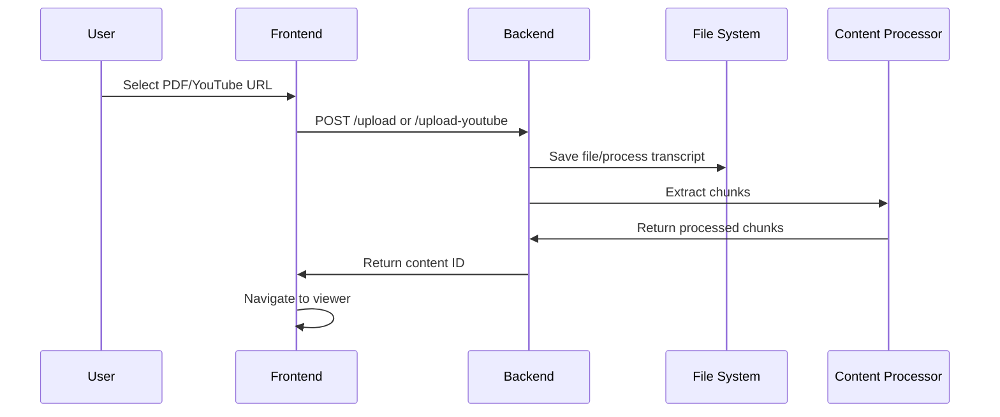
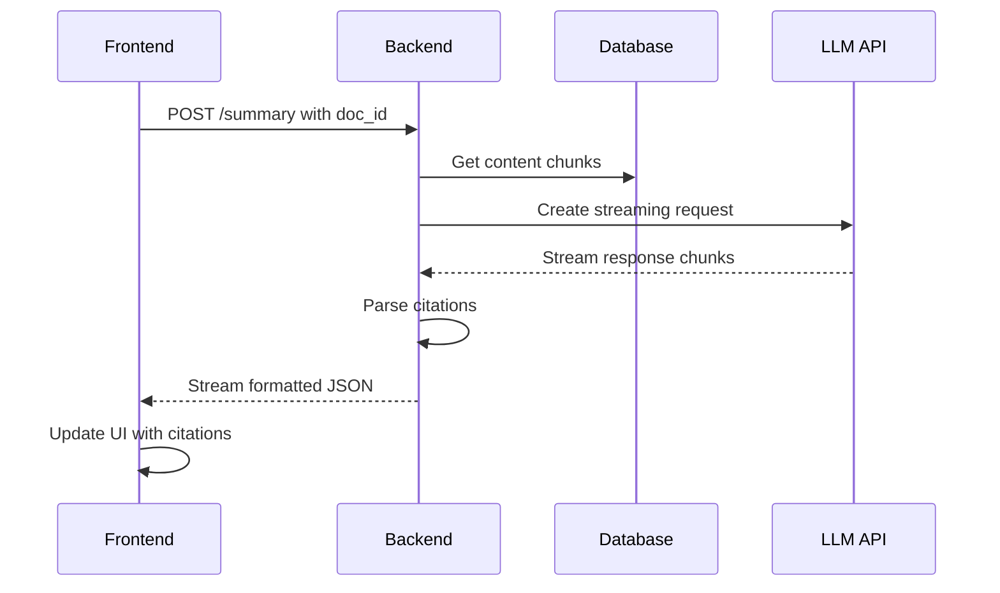
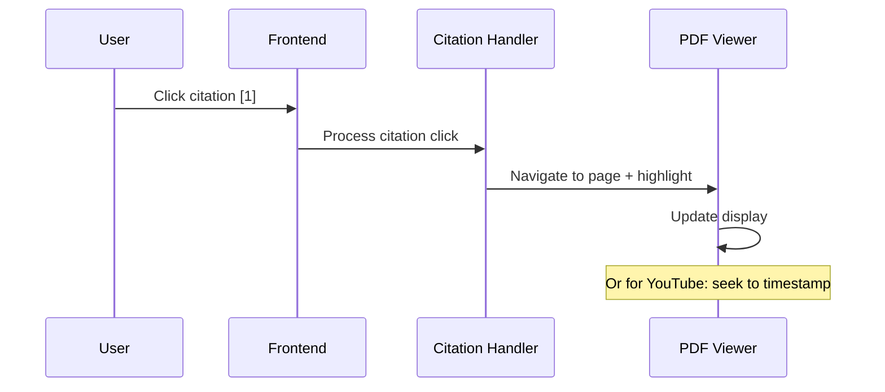

# YouLearn: Technical Documentation & Architecture Guide

## Table of Contents
1. [Project Overview](#project-overview)
2. [System Architecture](#system-architecture)
3. [Backend Deep Dive](#backend-deep-dive)
4. [Frontend Deep Dive](#frontend-deep-dive)
5. [Data Flow & Processing Pipeline](#data-flow--processing-pipeline)
6. [API Design & Endpoints](#api-design--endpoints)
7. [Key Technologies & Libraries](#key-technologies--libraries)
8. [Development Workflow](#development-workflow)
9. [Performance Optimizations](#performance-optimizations)
10. [Deployment & Production Considerations](#deployment--production-considerations)

---

## Project Overview

**YouLearn** is a sophisticated AI-powered document and video analysis platform that generates streaming summaries with interactive citations. The application processes PDF documents and YouTube videos, extracts content into chunks, and generates real-time summaries using Large Language Models (LLMs) with precise citation mapping.

### Core Capabilities
- **Multi-format Content Processing**: PDFs and YouTube videos
- **Real-time Streaming Summaries**: Live LLM-generated content with citations
- **Interactive Citation Navigation**: Click citations to jump to source locations
- **Content Upload & Management**: File upload with processing pipeline
- **Responsive UI**: Split-pane interface with resizable layouts

---

## System Architecture

### High-Level Architecture

```
┌─────────────────┐    ┌─────────────────┐    ┌─────────────────┐
│   Frontend      │    │    Backend      │    │  External APIs  │
│   (Next.js)     │◄──►│   (FastAPI)     │◄──►│  OpenRouter     │
│                 │    │                 │    │  YouTube API    │
└─────────────────┘    └─────────────────┘    └─────────────────┘
         │                       │
         │                       │
┌─────────────────┐    ┌─────────────────┐
│   PDF.js        │    │  File Storage   │
│   Lector        │    │  (uploads/)     │
└─────────────────┘    └─────────────────┘
```

### Technology Stack

**Frontend:**
- **Framework**: Next.js 15.4.5 with React 19
- **Language**: TypeScript
- **Styling**: Tailwind CSS 4.x
- **PDF Rendering**: PDF.js + Lector (@anaralabs/lector)
- **Math Rendering**: KaTeX + react-katex
- **Markdown**: react-markdown
- **State Management**: TanStack Query (React Query)

**Backend:**
- **Framework**: FastAPI (Python)
- **Server**: Uvicorn with auto-reload
- **LLM Integration**: OpenAI SDK → OpenRouter
- **PDF Processing**: PyPDF2
- **YouTube Processing**: youtube-transcript-api
- **Environment**: python-dotenv

---

## Backend Deep Dive

### Core Architecture (`app.py`)

The backend is built using **FastAPI**, providing a modern, fast web API with automatic OpenAPI documentation.

#### Application Structure
```python
# App initialization with metadata
app = FastAPI(
    title="YouLearn API",
    description="Content processing and summary generation service",
    version="1.0.0"
)

# CORS middleware for frontend communication
app.add_middleware(CORSMiddleware, ...)

# Router inclusion for modular endpoints
app.include_router(debug_router)
```

#### Key Imports & Dependencies
```python
from fastapi import FastAPI, Path, File, UploadFile, HTTPException
from fastapi.middleware.cors import CORSMiddleware
from fastapi.responses import StreamingResponse
from fastapi.staticfiles import StaticFiles
from pydantic import BaseModel, Field
```

### Content Processing Pipeline

#### 1. PDF Processing (`pdf_processor.py`)
- **Library**: PyPDF2 for text extraction
- **Process**: Extract text chunks with bounding box coordinates
- **Storage**: JSONL format with page numbers and bbox data
- **Filtering**: Content filtering to remove diagrams, symbols, etc.

#### 2. YouTube Processing (`youtube_processor.py`)
- **Library**: youtube-transcript-api
- **Process**: Extract transcripts with timing information
- **Chunking**: Natural language chunking with 10-second target duration
- **Storage**: JSONL format with start_time, duration, end_time

#### 3. Summary Generation (`summary_generation.py`)

**LLM Integration:**
```python
client = AsyncOpenAI(
    base_url="https://openrouter.ai/api/v1",
    api_key=OPENROUTER_API_KEY,
)
```

**Streaming Implementation:**
```python
async def generate_summary_stream(doc_id: str) -> AsyncGenerator[str, None]:
    # Create prompt with numbered chunks
    prompt = create_prompt_with_chunks(extracts, content_type)

    # Stream response from LLM
    response = await client.chat.completions.create(
        model="openai/gpt-4o",
        messages=[...],
        stream=True,
        temperature=0.3,
        max_tokens=4000
    )

    # Process and yield streaming chunks
    async for chunk in response:
        # Extract citations and yield formatted JSON
        yield json.dumps(data) + "\n"
```

### Data Management (`db.py`)

**Mock Database Structure:**
```python
@dataclass
class PDFExtract:
    text: str              # Extracted text content
    page_number: int       # Page number (1-indexed)
    bbox: List[float]      # Bounding box [x1, y1, x2, y2]

@dataclass
class YouTubeExtract:
    text: str          # Transcript text segment
    start_time: float  # Start time in seconds
    duration: float    # Duration of segment
    end_time: float    # End time in seconds
```

**Content Filtering Logic:**
- Removes chemical formulas, diagrams, single characters
- Filters out figure references and image placeholders
- Preserves meaningful text content for processing

### API Endpoints

#### Core Endpoints
1. **`POST /summary`** - Generate streaming summaries
2. **`POST /upload`** - PDF file upload and processing
3. **`POST /upload-youtube`** - YouTube video processing
4. **`GET /content/{doc_id}`** - Content metadata retrieval
5. **`GET /chunks/{doc_id}`** - Debug chunk inspection
6. **`GET /youtube-transcript/{video_id}`** - Transcript segments

#### Debug Endpoints (`debug_chunks.py`)
- **`GET /debug/chunks/{doc_id}`** - Detailed chunk analysis with statistics
- Provides bounding box calculations, text length analysis, page distribution

---

## Frontend Deep Dive

### Application Structure

#### Next.js App Router Structure
```
app/
├── layout.tsx                 # Root layout with providers
├── page.tsx                   # Landing page (content selection)
├── render/page.tsx           # Main viewer (PDF + summary)
├── debug/page.tsx            # Debug chunk viewer
├── components/               # React components
└── providers/                # Context providers
```

### Key Components

#### 1. Content Viewer (`render/page.tsx`)

**Core State Management:**
```typescript
const [contentUrl, setContentUrl] = useState<string>("");
const [contentTitle, setContentTitle] = useState<string>("Loading...");
const [contentType, setContentType] = useState<'pdf' | 'youtube'>('pdf');
const [activeHighlight, setActiveHighlight] = useState<{ page: number; bbox: number[] } | null>(null);
```

**Streaming Hook Integration:**
```typescript
const { summary, citations, isStreaming, error, startStream } = useSummaryStream(docId);
```

#### 2. PDF Viewer (`enhanced-pdf-viewer.tsx`)
- **Library**: @anaralabs/lector (PDF.js wrapper)
- **Features**: Page navigation, highlighting, bounding box visualization
- **Performance**: Memoized highlights to prevent unnecessary re-renders

#### 3. YouTube Player (`youtube-player.tsx`)
- **Integration**: YouTube embed API
- **Features**: Timestamp navigation, time tracking
- **Synchronization**: Syncs with transcript display

#### 4. Citation Renderer (`citation-renderer.tsx`)

**Citation Processing:**
```typescript
// Parse citation patterns like [1], [2], [1,2,3]
const citationPattern = r'\[(\d+(?:[-,]\s*\d+)*)\]';

// Create clickable citation buttons
const handleCitationClick = useCallback(async (citationId: string, citation: Citation) => {
    if (contentType === 'youtube') {
        youtubePlayerRef.current?.seekToTime(citation.start_time);
    } else {
        pdfViewerRef.current?.goToPage(citation.page);
        pdfViewerRef.current?.highlightArea(citation.page, citation.bbox);
    }
}, [contentType]);
```

### Streaming Implementation (`useSummaryStream.ts`)

**Core Hook Architecture:**
```typescript
export function useSummaryStream(docId: string): UseSummaryStreamReturn {
    const [summary, setSummary] = useState('');
    const [citations, setCitations] = useState<Record<string, Citation>>({});
    const [isStreaming, setIsStreaming] = useState(false);

    // Throttled updates for smooth streaming
    const throttledSetSummary = useCallback((newSummary: string) => {
        setTimeout(() => setSummary(newSummary), 25);
    }, []);

    // Streaming response processing
    const processStreamChunk = async (reader: ReadableStreamDefaultReader) => {
        const { done, value } = await reader.read();
        const data: StreamData = JSON.parse(line);

        if (data.type === 'content') {
            throttledSetSummary(data.accumulated);
            setCitations(prev => ({ ...prev, ...data.citations }));
        }
    };
}
```

### UI Components Deep Dive

#### Resizable Layout (`resizable-layout.tsx`)
- **Implementation**: CSS flexbox with draggable splitter
- **Persistence**: Layout state maintained during resize
- **Responsive**: Adapts to different screen sizes

#### Transcript Display (`transcript-display.tsx`)
- **Features**: Clickable timestamps, current time highlighting
- **Synchronization**: Real-time sync with video playback
- **Formatting**: Time display in MM:SS format

---

## Data Flow & Processing Pipeline

### 1. Content Upload Flow



### 2. Summary Generation Flow



### 3. Citation Interaction Flow



---

## API Design & Endpoints

### RESTful API Structure

#### Content Management Endpoints

**`POST /upload`**
```python
async def upload_pdf(file: UploadFile = File(...)):
    # Validate PDF file
    if not file.filename.lower().endswith('.pdf'):
        raise HTTPException(status_code=400, detail="Only PDF files allowed")

    # Generate unique ID and save
    file_id = f"uploaded_{uuid.uuid4().hex[:8]}"

    # Process PDF chunks
    save_pdf_chunks(file_id, file_path)

    return {"file_id": file_id, "filename": file.filename}
```

**`POST /upload-youtube`**
```python
async def process_youtube_video(data: YouTubeRequest):
    video_id = extract_video_id(data.url)

    # Check if already processed
    if video_id in processed_videos:
        return {"status": "already_processed"}

    # Extract and process transcript
    save_youtube_chunks(video_id, data.url)

    return {"video_id": video_id, "status": "processed"}
```

#### Streaming Endpoint

**`POST /summary`**
```python
async def generate_summary(data: SummaryRequest):
    return StreamingResponse(
        generate_summary_stream(doc_id=data.doc_id),
        media_type="application/json"
    )
```

**Response Format:**
```json
{
    "type": "content",
    "text": "partial summary text...",
    "citations": {
        "1": {
            "page": 1,
            "bbox": [100, 200, 300, 250],
            "text": "cited text content",
            "chunk_id": "page1_chunk1"
        }
    },
    "accumulated": "full summary so far...",
    "content_type": "pdf"
}
```

### Error Handling Strategy

**Structured Error Responses:**
```python
raise HTTPException(
    status_code=404,
    detail="Content not found. Available preset PDFs: pdf_1, pdf_2, pdf_3"
)
```

**Graceful Degradation:**
- Continue processing even if text extraction fails
- Provide fallback content for missing data
- Detailed error logging for debugging

---

## Key Technologies & Libraries

### Backend Libraries

#### Core Framework
- **FastAPI**: Modern, fast web framework with automatic API docs
- **Uvicorn**: ASGI server with hot reload for development
- **Pydantic**: Data validation using Python type hints

#### Content Processing
- **PyPDF2**: PDF text extraction and manipulation
- **youtube-transcript-api**: YouTube transcript downloading
- **OpenAI SDK**: LLM API integration (via OpenRouter)

#### Utilities
- **python-dotenv**: Environment variable management
- **python-multipart**: File upload handling

### Frontend Libraries

#### Core Framework
- **Next.js 15.4.5**: React framework with App Router
- **React 19**: Latest React with concurrent features
- **TypeScript**: Type-safe JavaScript development

#### UI & Styling
- **Tailwind CSS 4.x**: Utility-first CSS framework
- **@tailwindcss/postcss**: PostCSS integration

#### Content Rendering
- **@anaralabs/lector**: Advanced PDF viewer with highlighting
- **pdfjs-dist**: Core PDF.js library
- **react-katex**: Mathematical expression rendering
- **react-markdown**: Markdown to React component conversion

#### State Management
- **TanStack Query**: Data fetching, caching, and synchronization
- **React Hooks**: Built-in state management

---

## Development Workflow

### Project Structure
```
youlearn/
├── backend/                   # FastAPI backend
│   ├── app.py                # Main application
│   ├── db.py                 # Data layer
│   ├── summary_generation.py # LLM integration
│   ├── pdf_processor.py      # PDF processing
│   ├── youtube_processor.py  # YouTube processing
│   ├── debug_chunks.py       # Debug endpoints
│   ├── requirements.txt      # Python dependencies
│   ├── pdfs/                 # Preset PDF chunks
│   ├── youtube/              # YouTube transcript chunks
│   └── uploads/              # User uploaded files
├── frontend/                  # Next.js frontend
│   ├── app/                  # App Router pages
│   │   ├── components/       # React components
│   │   ├── providers/        # Context providers
│   │   └── hooks/           # Custom hooks
│   ├── package.json         # Node dependencies
│   └── tsconfig.json        # TypeScript config
└── package.json             # Monorepo scripts
```

### Development Commands

**Start Development Environment:**
```bash
npm run dev              # Start both frontend and backend
npm run dev:frontend     # Frontend only (Next.js)
npm run dev:backend      # Backend only (FastAPI)
```

**Installation:**
```bash
npm install              # Install all dependencies
npm run install:frontend # Frontend dependencies only
npm run install:backend  # Backend dependencies only
```

### Environment Configuration

**Backend (`.env`):**
```
OPENROUTER_API_KEY=your_api_key_here
```

**Development URLs:**
- Frontend: http://localhost:3000
- Backend: http://localhost:8000
- API Docs: http://localhost:8000/docs

---

## Performance Optimizations

### Backend Optimizations

#### Streaming Response
```python
async def generate_summary_stream(doc_id: str) -> AsyncGenerator[str, None]:
    # Stream processing for real-time updates
    async for chunk in response:
        yield json.dumps(data) + "\n"
        await asyncio.sleep(0.01)  # Smooth streaming
```

#### Content Filtering
```python
def should_include_chunk(text: str) -> bool:
    # Efficient filtering to reduce noise
    if len(text) < 3: return False
    if text.isdigit(): return False
    # ... additional filtering logic
```

#### Caching Strategy
- In-memory storage for uploaded content metadata
- Processed content chunks cached on disk
- Duplicate video processing prevention

### Frontend Optimizations

#### Memoization
```typescript
// Prevent unnecessary re-renders
const highlights = useMemo(() => {
    return activeHighlight ? [activeHighlight] : [];
}, [activeHighlight]);

// Stable citation click handler
const handleCitationClick = useCallback(async (citationId: string, citation: Citation) => {
    // Citation handling logic
}, [contentType]);
```

#### Throttled Updates
```typescript
// Smooth streaming with throttled updates
const throttledSetSummary = useCallback((newSummary: string) => {
    setTimeout(() => setSummary(newSummary), 25);
}, []);
```

#### Component Optimization
- React.memo for expensive components
- useRef for values that don't trigger re-renders
- Efficient state updates to minimize render cycles

---

## Deployment & Production Considerations

### Environment Setup

**Production Environment Variables:**
```
OPENROUTER_API_KEY=production_key
CORS_ORIGINS=https://yourdomain.com
UPLOAD_MAX_SIZE=50MB
```

### Security Considerations

#### File Upload Security
```python
# Validate file types
if not file.filename.lower().endswith('.pdf'):
    raise HTTPException(status_code=400, detail="Only PDF files allowed")

# Generate secure file IDs
file_id = f"uploaded_{uuid.uuid4().hex[:8]}"
```

#### CORS Configuration
```python
app.add_middleware(
    CORSMiddleware,
    allow_origins=["http://localhost:3000"],  # Restrict in production
    allow_credentials=True,
    allow_methods=["*"],
    allow_headers=["*"],
)
```

### Scalability Considerations

#### Database Migration
- Current: In-memory + file storage
- Production: PostgreSQL/MongoDB for metadata
- Files: S3/CloudFlare R2 for document storage

#### Load Balancing
- Multiple FastAPI instances behind load balancer
- Sticky sessions for streaming connections
- Redis for shared session state

#### Monitoring
- API response time monitoring
- LLM API usage tracking
- Error rate monitoring
- User analytics

---

## Key Interview Points

### Technical Decisions

1. **Why FastAPI?**
   - Automatic OpenAPI documentation
   - Native async support for streaming
   - Type safety with Pydantic
   - High performance

2. **Why Next.js with App Router?**
   - Server-side rendering capabilities
   - File-based routing
   - Built-in optimization
   - TypeScript integration

3. **Streaming Implementation**
   - Real-time user feedback
   - Efficient memory usage
   - Better perceived performance
   - Handles large documents gracefully

4. **Citation System Design**
   - Precise source tracking
   - Interactive navigation
   - Visual feedback
   - Cross-platform consistency (PDF/YouTube)

### Challenges Overcome

1. **Real-time Citation Parsing**
   - Regex-based citation extraction
   - Handling multiple citation formats
   - Maintaining citation-to-source mapping

2. **PDF Highlighting**
   - Coordinate system mapping
   - Bounding box calculations
   - Cross-page navigation

3. **Performance Optimization**
   - Throttled streaming updates
   - Memoized components
   - Efficient state management

### Future Enhancements

1. **Database Integration**
   - Persistent storage
   - User accounts
   - Document management

2. **Advanced Features**
   - Multi-document analysis
   - Custom LLM models
   - Collaborative annotations

3. **Scalability**
   - Microservices architecture
   - Container deployment
   - CDN integration

This comprehensive documentation should prepare you thoroughly for any technical questions about the YouLearn project. The combination of high-level architecture understanding and detailed implementation knowledge will demonstrate both your technical depth and architectural thinking.